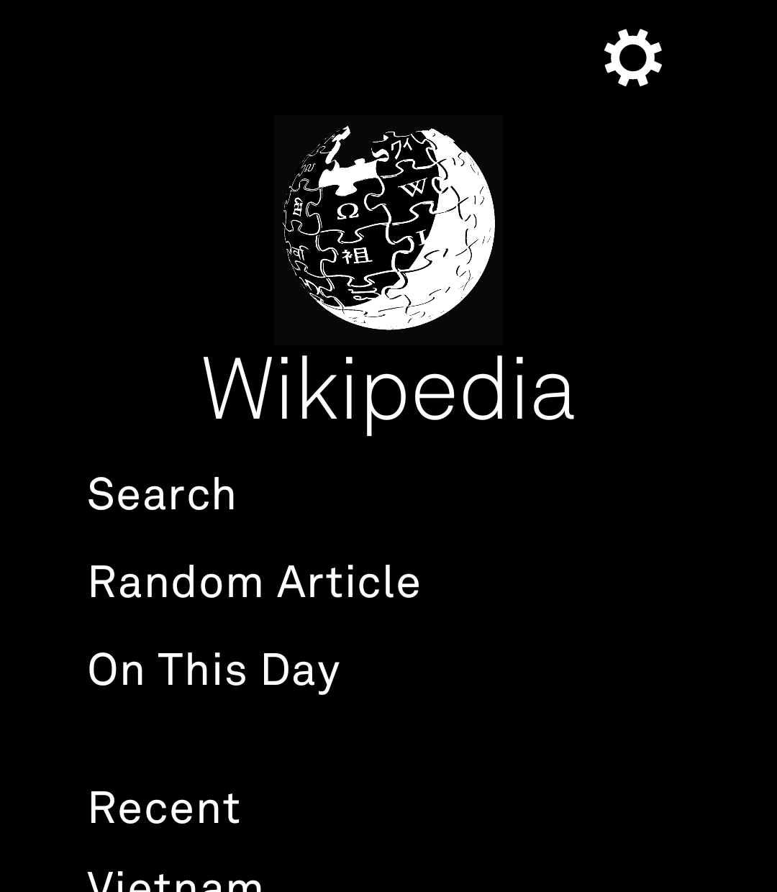

# Wikipedia for Light Phone III

A calm, text-first Wikipedia reader built for the Light Phone III using the
[Light SDK](https://github.com/lightphone/light-sdk). Search articles, open
random ones, browse what happened *on this day*, and jump straight to the next
section or related articles — all in LightOS's monochrome, distraction-free
style.

This tool is a fork of the Light SDK repo with all changes living in the `tool/`
module, which is what Light's build pipeline compiles (`./gradlew :tool:assembleRelease`).

## Features

- **Search** — look up any Wikipedia article.
- **Random Article** — open a random article (also available from inside any article).
- **On This Day** — see what actually happened on today's date, with the linked
  Wikipedia pages shown as tappable articles beneath each event.
- **Recent** — your last few opened articles, one tap to reopen.
- **Article view** — readable plain-text extract with section navigation
  ("skip to next section") and the full list of related articles, each tappable.

## Screenshots



*Home screen: Search, Random Article, On This Day, and Recent.*

## Current status

This is an early community submission built against the Light SDK. It is
**not yet Light-vetted**. Until Light's official "build it, sign it, share it"
pipeline is live, you can sideload the debug APK onto a Light Phone III via ADB
(the same way any Android APK is installed). LightOS will warn that the tool
isn't vetted yet — that is expected for a community build.

## Building

The Wikipedia tool lives in the `tool/` module. From the repo root:

```bash
./gradlew :tool:assembleDebug
```

The resulting APK is at `tool/build/outputs/apk/debug/tool-debug.apk`.

`tool/lighttool.toml` targets real LightOS (`serverPackage = "com.lightos"`).
To run against the LightOS emulator instead, switch that line to
`com.thelightphone.sdk.emulator`.

To install on a device:

```bash
adb install -r tool/build/outputs/apk/debug/tool-debug.apk
```

## Notes

- Requires `android.permission.INTERNET` (Wikipedia REST + Action APIs).
- Article text and metadata are from the Wikimedia APIs; content is licensed
  under [CC BY-SA](https://creativecommons.org/licenses/by-sa/4.0/). The app's
  About screen credits this.
- No account, no tracking, no ads — just Wikipedia.

## License

MIT — see the repository [LICENSE](../../LICENSE).
